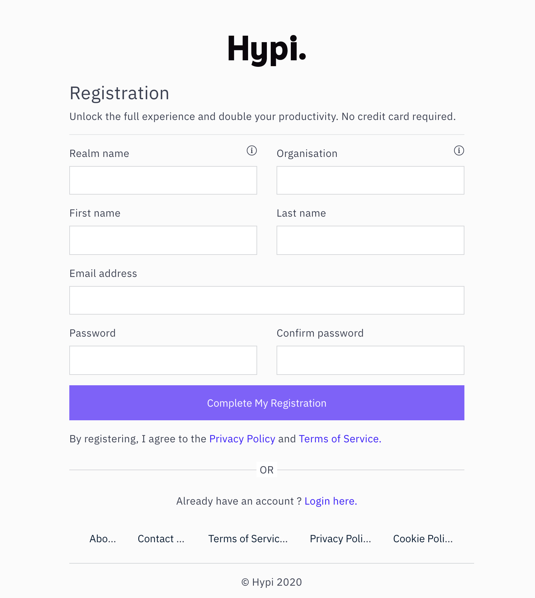
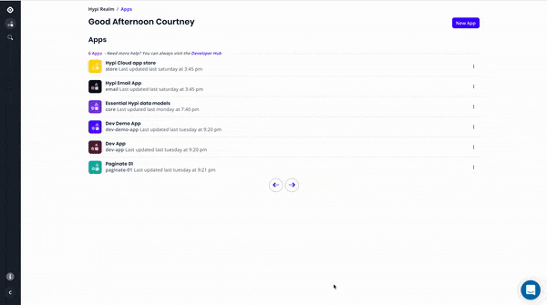
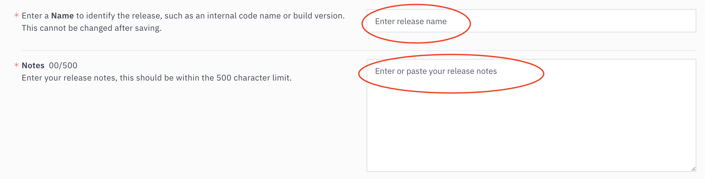
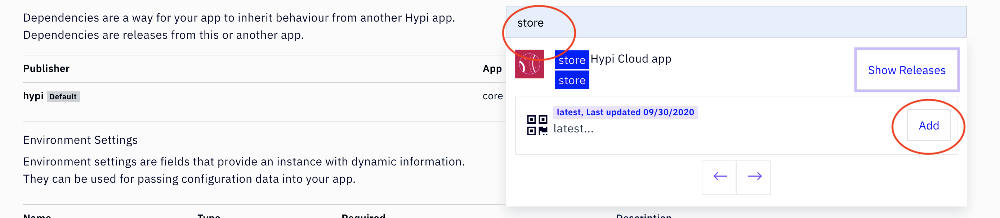
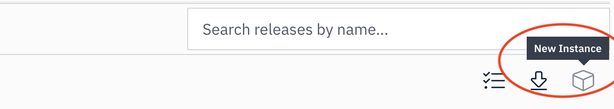
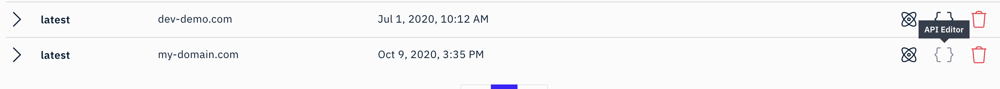

##  Overview

It's easy to start using Hypi. Below are incremental steps that will get you moving quickly. With Hypi you can start building cloud applications and web services that just works.

### Creating an account

Navigate to <a href="https://hypi.app/auth/register" target="_blank">hypi.app/auth/register</a>, and create a new Hypi account. Fill in the required fields and click `complete my registration`.
<ul>
<li>

`Realm name` — A namespace for all your apps, this should be unique and memorable. It cannot be changed once created and is used in URLs.
</li>
<li>

`Organisation` — Name of your company, team, group or organisation.
</li>
</ul>

### Creating an app

To create an app, click the `New app` button. And fill in the required fields. `App label` —  a human-friendly way to recognised your apps.`App name` — a string used as a unique identifier for your apps; cannot be changed and is used in URLs.

 

### Creating a release
Creating a new app will trigger a release/versioning modal dialog. If it doesn't appear, go to the releases tab and click `New Release`. Fill in the required fields. `Release name` — is unique to the release being created and `Release notes`  — are an easy way to document your release/versions and can be updated anytime.

> By default `core` a system app is added as a dependency.
>
> Speed and accuracy are crucial in our modern world, which is why we designed a system app called `core`, it as a schema with essential types any app or service would need. Such as `Account`, `Person`, `Email`, `Password` and lots more.
>
> Dependencies promote software reuse by enabling you to build small reusable apps that you can add as dependencies in other apps. <a href="/introduction#dependencies">Learn about dependencies here</a>.

#### Required fields

#### Adding app as a dependency
Start by searching for the app you like to use as a dependency, then select the release of that app by clicking `Add`. After saving the release, your app's release will inherit the behaviour of the dependent app that you have added.

### Modelling your schema
Navigate to the editor to create your data types for a release. In Hypi, by defining types and modelling a release schema, you are actually defining the data tables for your release and building relationships between them. If you want to learn more about Graphql Schemas & Types <a href="/tutorials/graphql/schema-and-types" target="_blank">click here.</a>

  

### Creating an instance API

Great! Now that you have a release/version for your app,  you can quickly generate a unique API where you can post your <a hred="/products/axiom/crud">CRUD operations</a> and more. There are two ways to access the modal that will generate your API.

 1: Click the `New Instance` cube icon button to the right of your release. A modal will appear, type in a domain name.
 
 2: Navigate to the instance tab and click `New instance`. A modal will appear type in a domain name.
     

### Querying your instance API

Here's the fun part! You can start querying your APIs instantly by clicking on the `API editor` icon button to the right of your domain. In the editor, you can run any GraphQL query on the left and see results instantly on the right. Also, take advantage of the editor's inspection tabs `Docs`  and `Schema`.
  
  

### Next steps
Learn how to add Hypi to your front end client using your favourite <a href="/getting-started/frontend-client">front-end client here.</a> Also, see  Hypi's Graphql CRUD tutorial <a href="/tutorials/crud">here.</a>

