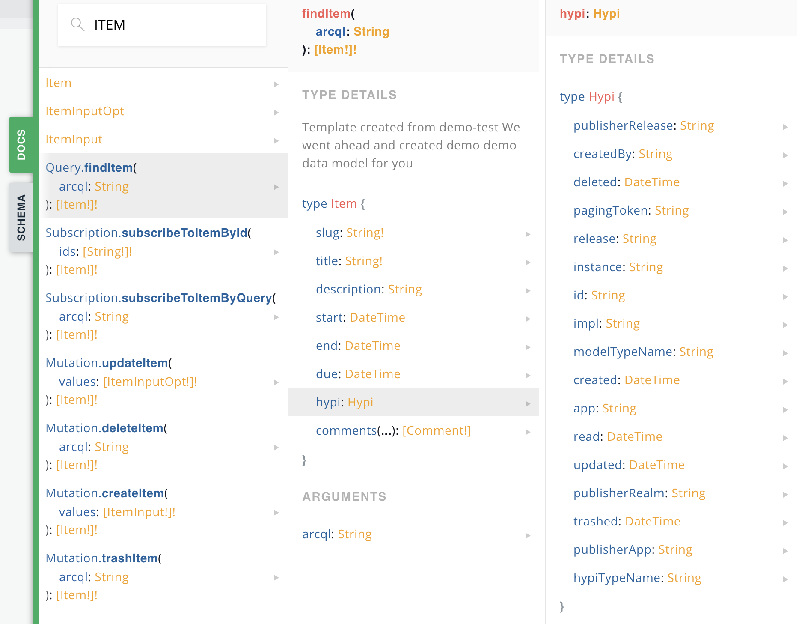

## Introduction

We like when things are pretty powerful, especially in programming, so we decided to create the `Hypi magic object`. **This object gets attached to every type 'behind the scenes'.** Thus, why we are calling the 'magic' Object – because its never directly called, and they allow the programmer to do some pretty powerful things. Confused? An example will help make this clear.

**Let's say you have a type:**

    type Item {
         slug: String! @field(indexed: true, type: Keyword)
         title: String! @field(indexed: true)
         description: String @field(indexed: true)
         comments: [Comment!]
    }

When you run a "operation" on `findItem`, you will notice the hypi magic object attached, you will also see it in your API DOCS. So every defined type in your schema will have the Hypi magic auto attached to it for some serious programming.

    type Item {
         slug: String! @field(indexed: true, type: Keyword)
         title: String! @field(indexed: true)
         description: String @field(indexed: true)
         comments: [Comment!]
	     hypi:Hypi // Hypi magic object 
    }

**Note: ** The Hypi magic object is always attached inside types, and is not a stand-alone object. Read on to see the available fields on the magic object.

**Lets find out, how we can use each field on the object:**

## Available fields
Here's a list of fields made available on the `Hypi Object` with there corresponding type. 

### App
`app: String`.
### Created
`created: DateTime`.

### Created By
`createdBy: String`.

### Deleted
`deleted: DateTime`.

### Hypi Type Name
`hypiTypeName: String`.

### Id
`id: String`.

### Impl
`impl: String`.

### Instance
`instance: String`.

### Model Type Name
`modelTypeName: String`.

### PagingToken
`pagingToken: String`.

### PublisherApp
`publisherApp: String`.

### PublisherRealm
`publisherRealm: String`.

### PublisherRelease
`publisherRelease: String`.

### Read
`read: DateTime`.

### Release
`release: String`.

### Trashed
`trashed: DateTime`.

### Updated
`updated: DateTime`.

## What fields can you override and when

### Id
`id: String`.

### Impl
`impl: String`.
