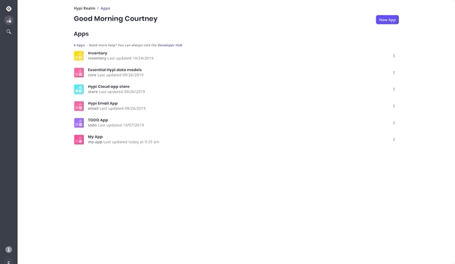

**Hypi** is centered around Apps. An App acts as a container or namespace for a group of related features including but not limited to the Data Models, Scripts, Blocks, Auth Policies and more. 

Hypi is an App oriented Platform, so much so almost every operation possible on the platform is done through an existing app, even creating an app uses the Hypi store app to create other apps.

## Releases   
A release represents a version of an App. Versioning is a critical component of your app updates and maintenance strategy. Versioning is important because:

* Each release/version can be independent.
* Other apps — including other apps that are created, can depend on other apps.

### Create a release
To create a new release go to the Hypi dashboard of the desired Realm.   
1. Click on the App you wish to create a release for.    
2. Click the releases tab on the left. Then click “New” top right.

### Add dependencies
Hypi features the very powerful capability of App inheritance where a dependency can be added to any App you have access to. Adding an App dependency immediately extends the API of your App so that all features in the dependencies become available for your App to use.
      
Hypi includes a "core" App which provides numerous features by default and is required. It defines essential data models e.g. to represent an Account.
 
 
  

### Add Fields
Instance fields provide a way for an App to have templated fields that are configurable on a per instance basis. 

A good example of where instance fields are useful is to hold configuration fields for an app for example a URL or API key (if your app is integrating with external services). 

Instance fields can later be accessed in serverless functions when they execute.

## Schema
Each created release have a demo data model, this so you can get started quiclky,  click on the "Editor" link to get access to the editor. You'll notice that the releases are to the left of the editor with a folder named after your created release. This folder will have your release schema file, of which you can edit and update.

  
In this image there are three releases in the todo app, alpha, beta and gama. The schema editor allows you to enter GraphQL definitions that will serve as the basis for the Apps data model and APIs. 

Currently the editor only have two modes **Save** and **Beautify**, simply click "save" to save yu your changes, the editor **doesn't save automatically**. Click, "Beautify" to clean up your code once done.

## Instances

### Create an Instance
### Editing Fields
### API Editor
### Metrics
